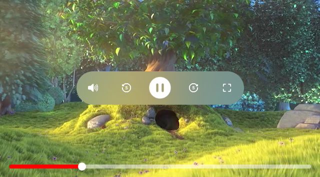

# Odeum

Odeum is a simple iOS Video player library with basic control


[](https://cocoapods.org/pods/Odeum)
[](https://cocoapods.org/pods/Odeum)
[](https://cocoapods.org/pods/Odeum)

<p align="center">

<p align="center">
  
## Example

To run the example project, clone the repo, and run `pod install` from the Example directory first.

## Requirements

- Swift 5.0 or higher
- iOS 10.0 or higher

## Installation

Odeum is available through [CocoaPods](https://cocoapods.org). To install
it, simply add the following line to your Podfile:

```ruby
pod 'Odeum'
```

## Author

Nayanda Haberty, nayanda1@outlook.com

## License

Odeum is available under the MIT license. See the LICENSE file for more info.

## Usage

Using Odeum is very easy. You could see the sample project or just read this documentation.

Since odeum player is subclass of `UIView`. adding player is same like adding simple `UIView`:

```swift
var odeumPlayer = OdeumPlayerView()
view.addSubview(odeumPlayer)
```
Is up to you how you want it to framed, using `NSLayoutConstraints` or by manually framing it.

You could also add it using storyboard or XIB. Just use `UIView` and set its `CustomClass` to be `OdeumPlayerView`.

<p align="center">

<p align="center">

To play the player, just add url:

```swift
odeumPlayer.play(url: myURL)
```

there are methods to manipulate video playing in odeum:
- `func set(url: URL)` to set url but not automatically play the video
- `func play()` to play the video if video is ready to play
- `func play(url: URL)` to set url and automatically play it if video is ready
- `func pause()` to pause the video
- `func set(mute: Bool)` to mute or unmute the video
- `func forward(by second: TimeInterval) -> Bool` to forward a video by given `TimeInterval`
- `func replay(by second: TimeInterval) -> Bool` to rewind a video by given `TimeInterval`
- `func goFullScreen()` to go to full screen
- `func dismissFullScreen()` to dismiss full screen

All those function will run automatically on the player control hover buttons

### Delegate

You could observe event in the OdeumPlayerView by give them delegate:

```swift
public protocol OdeumPlayerViewDelegate: class {
    func odeumDidPlayVideo(_ player: OdeumPlayerView)
    func odeumDidPauseVideo(_ player: OdeumPlayerView)
    func odeumViewControllerToPresentFullScreen(_ player: OdeumPlayerView) -> UIViewController
    func odeumDidGoToFullScreen(_ player: OdeumPlayerView)
    func odeumDidDismissFullScreen(_ player: OdeumPlayerView)
    func odeumDidMuted(_ player: OdeumPlayerView)
    func odeumDidUnmuted(_ player: OdeumPlayerView)
    func odeum(_ player: OdeumPlayerView, forwardedBy interval: TimeInterval)
    func odeum(_ player: OdeumPlayerView, rewindedBy interval: TimeInterval)
    func odeumDidBuffering(_ player: OdeumPlayerView)
    func odeumDidFinishedBuffering(_ player: OdeumPlayerView)
    func odeum(_ player: OdeumPlayerView, progressingBy percent: Double)
}
```

All the methods are optionals

### PlayerControl

If user tap the video player, it will show `PlayerControlView` which will control how the video will be played in `OdeumPlayerView`. You could also change the icon of the `PlayerControlView`:

```swift
odeumPlayer.playerControl.set(icon: myIcon, for: ReplayStep.fiveSecond)
```

the states are:

```swift
public enum PlayState {
    case played
    case paused
}

public enum AudioState {
    case mute
    case unmute
}

public enum ReplayStep {
    case fiveSecond
    case tenSecond
    case thirtySecond
}

public enum ForwardStep {
    case fiveSecond
    case tenSecond
    case thirtySecond
}

public enum FullScreenState {
    case fullScreen
    case minimize
}
```

To change the replay step and audio state time interval, you could assign it directly on `playerControl`:

```swift
odeumPlayer.playerControl.forwardStep = .thirtySecond
odeumPlayer.playerControl.replayStep = .thirtySecond
```

### Contribute

You know how, just clone and do pull request
